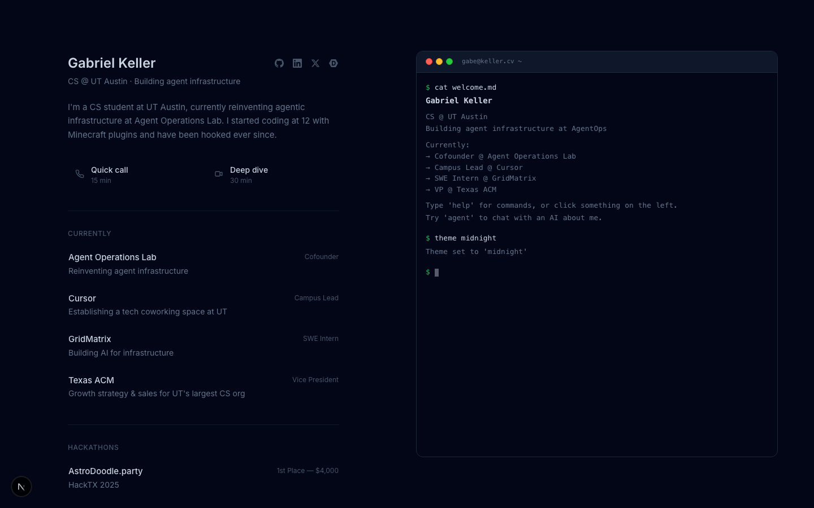
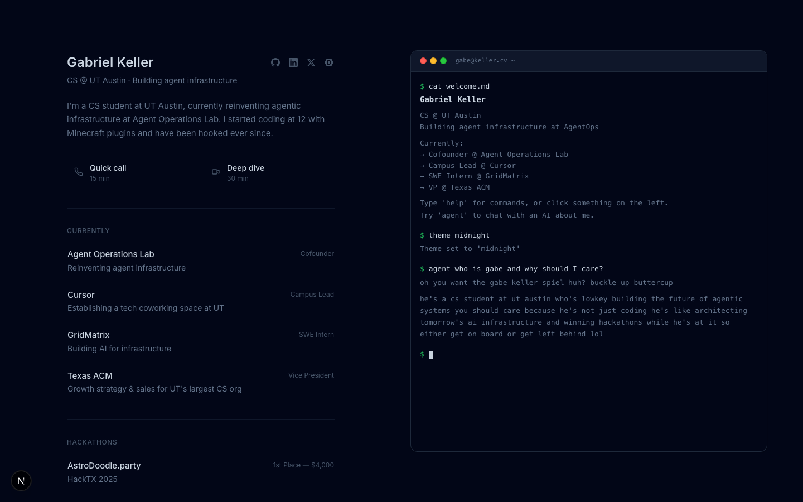

# keller.cv

Personal website for [Gabriel Keller](https://keller.cv). Split-panel layout with a bio/portfolio on the left and an interactive terminal on the right. The terminal has a virtual filesystem, multiple color themes, and a conversational AI agent that knows everything about Gabe and will roast you if you ask a lazy question.



## How it works

The site is a single-page layout. The left panel has the standard portfolio stuff: bio, work experience, hackathon wins, blog posts, and social links. Every card is clickable and pipes its content into the terminal on the right. On mobile, the terminal slides up as an overlay.

### Terminal

The right panel is a fully custom terminal emulator built as a React component. It simulates a real shell with a virtual filesystem constructed at build time from markdown files in `content/terminal/`. Supported commands:

- `ls`, `cd`, `pwd` -- navigate the filesystem
- `cat` -- read files
- `open` -- open associated links
- `theme` -- cycle through color themes (light, dark-blue, dark-gray, warm, midnight)
- `agent` -- start a conversation with the AI agent
- `help`, `man`, `whoami`, `clear`

There's also a hidden `.secret` file. Good luck finding it.

### AI Agent

The terminal's standout feature. Type `agent` (or `claude` or `codex`) to start chatting with an AI that acts as Gabe's digital representative. It's not a generic chatbot -- it has a hand-written personality and knows Gabe's full context.



**How it's built:**

- Runs on **Gemini 2.0 Flash** via the [Vercel AI SDK](https://sdk.vercel.ai/)
- Responses stream in real-time through a Next.js API route (`/api/chat`)
- The system prompt (`content/agent/system-prompt.md`) defines the agent's personality: sassy, witty, lowercase-everything, Gen Z energy. It adapts tone for recruiters, friends, collaborators, and investors
- Context is assembled at build time from `content/agent/` files (identity, LinkedIn, resume) plus work items, hackathon wins, and blog posts pulled from the site's own content system
- Rate limited to 100 messages per IP per 24 hours, 30-message conversation window, 1000-char message cap -- Gabe pays for every message out of pocket
- The agent never fabricates credentials. It exaggerates for comedy but sticks to real facts

**What the agent knows:**

- Gabe's full bio, education (UT Austin CS '27), and contact info
- Work history: Nominal, GridMatrix, Paycom, Texas ACM, Cursor, Agent Operations Lab
- Hackathon wins with project details
- Blog posts with excerpts
- LinkedIn profile details and resume

### Content System

All site content lives in `content/` as markdown:

```
content/
  agent/          # AI agent context (identity, resume, linkedin, system prompt)
  blog/           # MDX blog posts
  terminal/       # Virtual filesystem files (about, projects, work)
    .secret       # Easter egg
```

Work experience, hackathon data, and social links are defined in `lib/data.ts`. Blog posts use MDX with `next-mdx-remote` for rendering.

### Themes

Five color themes, switchable via the `theme` command or the theme button. Auto-detection defaults to system preference (light or midnight). Themes apply to both the content panel and the terminal.

### Other Features

- `/llms.txt` -- LLM-friendly plain text version of the site content
- `/sitemap.xml` and `/robots.txt` -- SEO basics
- Open Graph and Twitter card images generated with `next/og`
- The domain uses the `.cv` TLD (Cape Verde) as a domain hack -- CV as in curriculum vitae

## Tech Stack

- [Next.js 15](https://nextjs.org/) with App Router
- [React 19](https://react.dev/)
- TypeScript
- [Tailwind CSS](https://tailwindcss.com/)
- [Vercel AI SDK](https://sdk.vercel.ai/) + Gemini 2.0 Flash
- Hosted on [Vercel](https://vercel.com/)

## Quick Start

```bash
pnpm install
pnpm dev
```

Set `GOOGLE_GENERATIVE_AI_API_KEY` in `.env.local` to enable the agent.

## License

MIT
