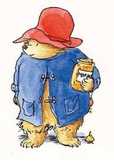

# Illustration Style Guide — keller.cv Blog

## Character

The mascot is a small teddy bear inspired by classic Paddington-style storytelling art: warm tan fur, round ears, bead-like eyes, and a small brown nose. The bear now wears a **red floppy hat** and **blue duffle coat** as the default outfit for OG scenes.

The bear is the recurring protagonist across all blog OG images. It acts out scenes that metaphorically represent each post's topic — similar to how Ben Borger's blog character appears in different situations per post.

## Art Style

**Medium**: Storybook watercolor-and-ink illustration inspired by classic Paddington Bear book art. Generated via image model with a horizontal OG composition.

**Lines**: Gentle hand-inked outlines with slight wobble and sketch warmth. Keep contours readable, but avoid hard vector-perfect edges.

**Fills**: Soft watercolor washes with visible brush texture and subtle paper grain. Let color pooling and bleed happen naturally in small areas.

**Background**: Clean white or very faint off-white. No gradients, no patterns, no text. The illustration stands alone.

**Composition**: Single scene on a wide canvas suitable for OG cards (target ratio ~`1.91:1`). Keep the bear as the focal point with surrounding props that support the action.

**Energy/Motion**: Use subtle curved motion lines around fast movement (typing paws, vibrating keyboard, steam curls from coffee) to imply frantic coding energy.

## Color Palette

| Element | Color |
|---------|-------|
| Bear fur | Warm tan / light brown |
| Hat | Warm red |
| Coat | Blue duffle coat |
| Ink outlines | Black, thick |
| Accent props | Soft blues, warm oranges, muted reds |
| Background | White (#FFFFFF or #FAFAFA) |
| Watercolor washes | Desaturated, never neon |

## Prompt Template

Use this as a base when generating new OG images. Replace `[SCENE]` with the post-specific concept.

```
Wide horizontal storybook watercolor-and-ink illustration inspired by classic
Paddington-style art on a clean off-white paper background. A small warm tan
teddy bear wearing a red floppy hat and blue duffle coat is [SCENE]. Keep
gentle hand-inked outlines, soft watercolor washes with visible brush texture,
and subtle paper grain. Add light motion lines where movement matters. No text,
no logos, no watermark. Keep composition readable at social preview size and
leave breathing room around the focal action.
```

## Inspiration + Change Log

### 2026-02-10 style shift
- **Why**: Move from "editorial cartoon" toward a more recognizable storybook bear aesthetic that feels warmer and more personal.
- **Reference image**: `docs/images/paddington-reference.png`
- **Notes**: Use the reference for palette + wardrobe cues only. Keep all generated scenes original.



## Existing Images

### "How I built keller.cv with Cursor and Claude in one afternoon"
- **File**: `public/images/blog/building-keller-cv/og-cover.png`
- **Backup of regenerated version**: `public/images/blog/building-keller-cv/og-cover-paddington-coding.png`
- **Scene**: Bear in red hat + blue coat, seated at a desk, frantically coding at a computer with a steaming coffee cup nearby.
- **Concept reasoning**: Represents the rapid, caffeinated shipping pace of the build session while aligning with the new storybook-inspired character system.

### "AI-Assisted Software Engineering in 2026" whiteboard variant
- **Working image chosen by hand**: `~/Downloads/Pasted Graphic.png`
- **Scene**: Bear teaching in front of a whiteboard/easel with simple code and flowchart marks.
- **Use case**: Preferred reference for the whiteboard/teaching pose because it preserves the same watercolor-and-ink feel as the first blog bear.

#### Saved Prompt

Use this exact prompt when regenerating the whiteboard/teaching bear:

```
Create the same bear-teaching-at-a-whiteboard illustration in the exact style of the first reference image. Match the first bear image very closely: storybook watercolor-and-ink, Paddington-inspired teddy bear, warm tan fur, red floppy hat, blue duffle coat, soft watercolor fills, visible brush texture, pencil-and-ink sketch lines, handmade painted look, gentle outlines, expressive face. The bear is standing beside a wooden easel or whiteboard, teaching software engineering concepts with simple code and flowchart marks. IMPORTANT: place the full illustration on a plain clean off-white paper background with no checkerboard, no transparency effect, no pattern, no shadow backdrop, no extra scene beyond the bear and easel. Keep the composition simple so the subject is easy to cut out later. No logos, no watermark, no extra text outside the whiteboard marks.
```

## Concept Guidelines

Each blog post's OG image should:

1. **Be a visual metaphor** for the post's topic, not a literal depiction
2. **Show the bear in action** — doing something, not just posing
3. **Have one clear focal action** — don't try to illustrate the whole post
4. **Include 2-3 supporting props** that add context without clutter
5. **Convey an emotion** — frantic, curious, proud, confused, mischievous — matching the post's tone

## Inspiration

Style references:
- Attached bear illustration source: `docs/images/paddington-reference.png`
- Ben Borger's blog covers: [ben.page](https://ben.page/)
